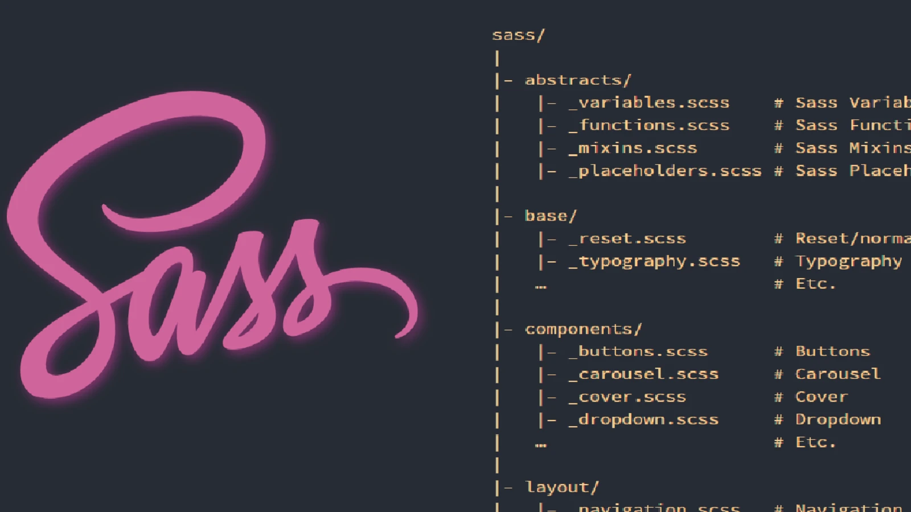
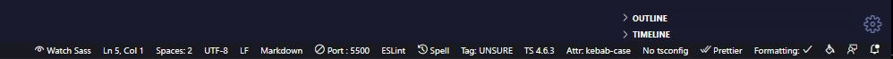

# SASS Structure Template

### Description 👈

This is the folder structure for newbie to learn about sass syntax.

### Setup 🚩

- IDE: Visual Studio Code Editor
- SASS
- Live Sass Compiler
- Live Server

### Usage 🚀

- Go to main.scss file
- Click watch sass extension in the bottom Visual Studio Code
- Open with live server
- You now can update all file with structure

#### ❄️Author: Quyen Dang

#### ⏰Created at 04-06-2022

#### 🔥 Facebook: https://www.facebook.com/QuyenGiaSuJS/

#### ✨Phone: (+84)337846412

